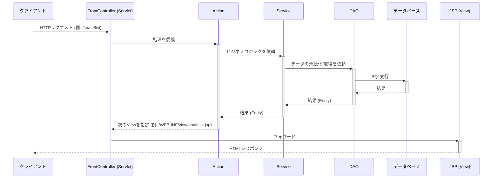
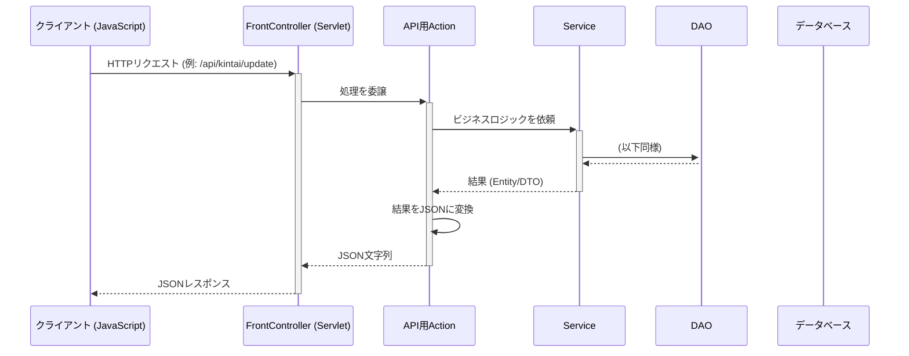

# 新アーキテクチャ設計書

## 1. はじめに

### 1.1. 目的

このドキュメントは、既存のWebアプリケーションの全体的な設計を見直し、新しいアーキテクチャを提案するものである。
主な目的は以下の通り。

-   **保守性の向上**: 各コンポーネントの役割を明確に分離し、コードの変更が他に与える影響を最小限に抑える。
-   **拡張性の向上**: 新機能の追加や仕様変更が容易に行える、柔軟な構造を実現する。
-   **可読性と学習効果の向上**: フレームワークを使用せず、責務が分離されたクリーンなコードを書くことで、Java Webアプリケーションの基本的な仕組みへの理解を深める。

### 1.2. 現状の課題

現在のコードベースには、以下の課題が存在する。

-   **関心の混在**: サーブレット、JSP、ビジネスロジック、DBアクセスなどの関心事が十分に分離されておらず、見通しが悪い箇所が見受けられる。
-   **構造の不統一**: `*.java.old` のような旧実装のファイルが残存しており、リファクタリングが過渡期にあることを示唆している。これにより、アプリケーションの全体像が掴みにくくなっている。
-   **処理の境界の曖昧さ**: 画面遷移を伴うリクエスト処理と、データのみを返すAPI的な処理が明確に区別されておらず、コントローラーの責務が肥大化しがちである。

---

## 2. 全体アーキテクチャ

### 2.1. 基本方針

フレームワーク非使用という制約のもと、**レイヤードアーキテクチャ**を採用する。各レイヤー（層）は明確に定義された責務のみを持ち、上位レイヤーは直下のレイヤーにのみ依存する。

-   **プレゼンテーション層 (Presentation Layer)**: ユーザーとのインターフェース、リクエストの受付、レスポンスの表示を担当。
-   **アプリケーション層 (Application Layer)**: アプリケーションの具体的なユースケース（ビジネスロジック）を実現する。トランザクション管理もこの層の責務とする。
-   **ドメイン層 (Domain Layer)**: アプリケーションの核となる概念（データ構造やビジネスルール）を表現する。
-   **インフラストラクチャ層 (Infrastructure Layer)**: データベースアクセスなど、技術的な詳細を実装する。

### 2.2. リクエストフロー

#### 画面遷移リクエスト



#### APIリクエスト (JSON)



---

## 3. 各レイヤーの責務と実装方針

### 3.1. プレゼンテーション層

-   **FrontController (Servlet)**
    -   全てのリクエスト（`.do` など特定の拡張子）をこの単一のServletで受け付ける。
    -   リクエストされたURLに基づき、実行すべき`Action`クラスを特定し、処理を委譲する。
    -   `Action`の実行結果（Viewの情報 or JSON文字列）に応じて、JSPへのフォワードまたはレスポンスへの直接書き込みを行う。

-   **Action (Controller)**
    -   リクエスト１つに対して１クラスを作成するコマンドパターンを基本とする。
    -   リクエストパラメータを検証し、ドメイン層のEntityなどに変換する。
    -   アプリケーション層の`Service`を呼び出し、ビジネスロジックの実行を依頼する。
    -   `Service`からの戻り値をリクエストスコープに設定し、表示すべき`View`の情報を`FrontController`に返す。
    -   API用の`Action`は、戻り値をJSON形式の文字列として`FrontController`に返す。

-   **JSP (View)**
    -   表示ロジックに特化させる。
    -   **スクリプトレット (`<% ... %>`) の使用を原則禁止**し、JSTLとEL式 (`${...}`) を用いて動的なコンテンツを表現する。

### 3.2. アプリケーション層

-   **Service**
    -   具体的なビジネスロジックを実装する。
    -   **トランザクション管理の責務を持つ**。`Connection`オブジェクトを生成し、一連の処理が正常に完了したらコミット、例外発生時にはロールバックを行う。
    -   複数の`DAO`を呼び出して、一連のビジネスユースケースを完結させる。
    -   依存性の注入（DI）: `Service`は必要な`DAO`をコンストラクタ経由で受け取る設計とし、`Service`と`DAO`の結合度を下げる。

### 3.3. ドメイン層

-   **Bean / Entity**
    -   データベースのテーブル構造に対応するプレーンなJavaオブジェクト (POJO)。
    -   `ShainBean`や`KintaiBean`などがこれにあたる。
    -   原則として、フィールドとそれに対応するゲッター/セッターのみを持つ。

### 3.4. インフラストラクチャ層

-   **DAO (Data Access Object)**
    -   データベースへのアクセス（CRUD操作）に特化する。
    -   **トランザクション管理は行わない**。`Service`層から渡された`Connection`オブジェクトを使ってSQLを実行する。これにより、複数のDB操作を１つのトランザクションにまとめることが可能になる。
    -   `PreparedStatement`を必ず使用し、SQLインジェクション脆弱性を防ぐ。
    -   SQL文は引き続き外部ファイル (`*.sql`) で管理する。

---

## 4. 新しいディレクトリ構成案

現在の構成をベースに、各レイヤーの責務がより明確になるよう整理する。

```
src/main/java/
└── com/example/
    ├── common/          # 共通ユーティリティ
    ├── controller/
    │   ├── FrontController.java
    │   ├── action/        # 画面遷移系Action
    │   │   ├── ShainListAction.java
    │   │   └── ...
    │   └── api/           # API系Action
    │       └── KintaiUpdateApiAction.java
    ├── dao/             # DAO (変更なし)
    │   ├── ShainDao.java
    │   └── ...
    ├── entity/          # ドメインEntity (旧beans)
    │   ├── Shain.java   (Bean -> サフィックスなしに)
    │   └── ...
    └── service/         # ビジネスロジック (旧model)
        ├── ShainService.java
        └── ...
```

---

## 5. 段階的な移行計画

巨大な変更を一度に行うのはリスクが大きいため、以下のステップで段階的にリファクタリングを進めることを提案する。

1.  **基盤整備**:
    -   `FrontController`サーブレットと`Action`の基本構造を実装する。
    -   まずは1つの機能（例: 社員一覧表示）を、この新しいアーキテクチャに沿って書き直す。

2.  **Service/DAOの責務分離**:
    -   `ShainService`にトランザクション管理機能を追加する。
    -   `ShainDao`を修正し、`Connection`を`Service`から受け取るように変更する。

3.  **JSPのリファクタリング**:
    -   `shainlist.jsp`からスクリプトレットを排除し、JSTLとEL式に完全に置き換える。

4.  **全機能への展開**:
    -   他の全ての機能（社員登録、更新、削除、勤怠管理など）について、1〜3のステップを繰り返し適用する。

5.  **APIの分離**:
    -   勤怠更新などのAPI処理を`controller.api`パッケージに分離し、JSONを返すように正式に修正する。
