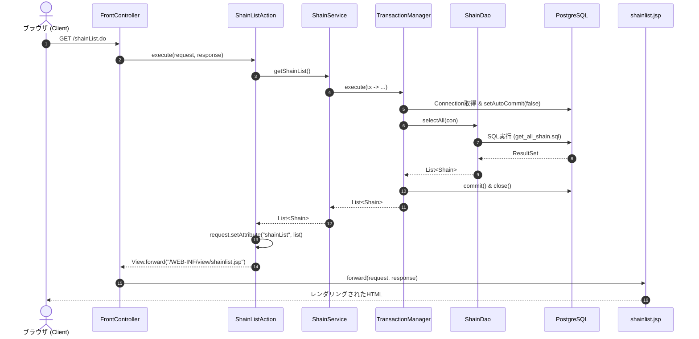
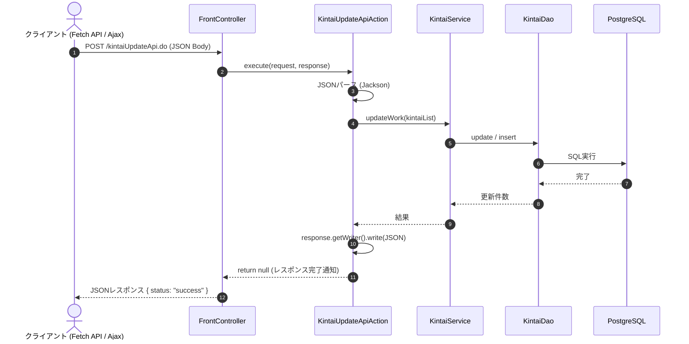

# MVC経験者のためのアーキテクチャ設計解説書

## 1. はじめに：なぜ単純なMVCではないのか？

一般的なWeb開発の入門では、**MVC（Model-View-Controller）** パターン（Model 2 MVC）が広く知られています。

- **Controller**: リクエストを受け付け、画面遷移を制御する（Servlet）
- **View**: 画面の見た目と描画を担当する（JSP）
- **Model**: それ以外のビジネスロジックやデータ保持、データベースアクセス

しかし、小〜中規模以上のシステム開発において単純なMVCをそのまま適用すると、以下のような問題（アンチパターン）が頻発します：

1. **Fat Controller**: Servlet内に「パラメータ解析」「DB接続」「SQL発行」「例外ハンドリング」「画面遷移」がすべて記述され、1つのServletが数百〜千行に肥大化する。
2. **Fat Model / 責務の混在**: Modelと一括りにされたJavaBeansやLogicクラスに、ビジネスロジックとSQLアクセスが混ざり、単体テストや再利用が極めて困難になる。
3. **トランザクション管理の破綻**: 複数のテーブル更新を行う際、どこで `commit` や `rollback` を行うべきかが曖昧になり、データの整合性が失われやすい。

本プロジェクトでは、Spring Bootなどの重量級フレームワークを使わない制約の中で、これらの問題を解決するために **「Front Controller + Command パターン」** と **「レイヤード・アーキテクチャ（Layered Architecture）」** を採用しています。

---

## 2. MVCと本アーキテクチャの対比

MVCの各要素が、本プロジェクトのどのコンポーネントに対応しているかを下表に示します。

| MVCの要素 | 本プロジェクトの設計 | 主なクラス・配置場所 | 責務・役割 |
| :--- | :--- | :--- | :--- |
| **Controller** | **Front Controller** | `com.example.controller.FrontController` | 全てのリクエスト（`*.do`）を一括で受け取り、適切なActionへルーティングするディスパッチャ |
|  | **Action (Command)** | `com.example.controller.action.*`<br>`com.example.controller.api.*` | リクエスト1つにつき1クラス。リクエストパラメータの検証・Serviceの呼び出し・遷移先Viewの決定のみを行う |
| **View** | **JSP / JSON View** | `src/main/webapp/WEB-INF/view/*.jsp`<br>`com.example.controller.View` | 表示専用。**スクリプトレット（`<% %>`）は禁止**し、JSTL/EL式、またはJavaScriptへのJSONデータ提供に特化 |
| **Model**<br>*(3つの独立した層に細分化)* | **① Service（アプリケーション層）** | `com.example.service.*`<br>`...service.transaction.TransactionManager` | **ユースケース・業務ロジックの実現**および**トランザクション管理**（コミット/ロールバック）。DAOを組み合わせて処理を完結 |
| | **② Entity（ドメイン層）** | `com.example.entity.*` | 業務データや状態を表す純粋なJavaオブジェクト（POJO）。DBテーブルと対応 |
| | **③ DAO & SQL（インフラ層）** | `dao.*`<br>`src/main/resources/sql/**/*.sql`<br>`com.example.infra.ConnectionBase` | **データベースアクセス（CRUD）専門**。SQLを外部ファイルで管理し、PreparedStatementで安全に実行 |

---

## 3. レイヤー構成と依存関係

システムは4つの階層（Layer）に分割されており、**「上位レイヤーは下位レイヤーに依存するが、下位レイヤーは上位レイヤーを知らない」** という単方向の依存関係を徹底しています。

```mermaid
graph TD
    subgraph プレゼンテーション層
        FC[FrontController (Servlet)] --> Action[Action (Command)]
        Action --> View[View (JSP / JSON)]
    end

    subgraph アプリケーション層
        Action --> Service[Service]
        Service --> TM[TransactionManager]
    end

    subgraph ドメイン層
        Entity[Entity (Data Models)]
    end

    subgraph インフラストラクチャ層
        Service --> DAO[DAO]
        DAO --> SQL[SQL Files (.sql)]
        DAO --> DB[(PostgreSQL)]
        TM --> DB
    end

    Action -.-> Entity
    Service -.-> Entity
    DAO -.-> Entity

    style プレゼンテーション層 fill:#f9f0ff,stroke:#d3adf7
    style アプリケーション層 fill:#e6f7ff,stroke:#91d5ff
    style ドメイン層 fill:#f6ffed,stroke:#b7eb8f
    style インフラストラクチャ層 fill:#fff7e6,stroke:#ffd591
```

---

## 4. リクエスト処理フロー

### 4.1. 画面遷移リクエスト（例: `/shainList.do`）



### 4.2. 非同期通信・APIリクエスト（例: `/kintaiUpdateApi.do`）



---

## 5. トランザクション管理の設計（TransactionManager）

### なぜDAOではなくServiceでトランザクションを管理するのか？
1つの業務処理（ユースケース）で複数のテーブルを更新する場合（例: 社員登録時に社員情報と初期勤怠データを同時に作成）、DAO内でコミットしてしまうと、2つ目のDAO操作でエラーが起きた際に1つ目の変更をロールバックできなくなります。

そのため、本プロジェクトでは **`TransactionManager`** を使ってService層でトランザクション境界を制御します。

```java
public class ShainService {
    private final TransactionManager tm = new TransactionManager();
    private final ShainDao shainDao = new ShainDao();

    public void registerShain(Shain shain) throws Exception {
        tm.execute(con -> {
            // 単一のConnection内で複数のDAO処理を実行
            shainDao.insert(con, shain);
            // 他のDAO呼び出しも同一トランザクション内で実行可能
            return null; // 正常終了で自動コミット、例外発生時は自動ロールバック
        });
    }
}
```

---

## 6. ディレクトリ・パッケージ解説

```text
10.project/webapp2/src/main/
├── java/
│   ├── com/example/
│   │   ├── common/                  # 共通ユーティリティ（文字列処理、JSONシリアライザ等）
│   │   ├── controller/              # [プレゼンテーション層]
│   │   │   ├── FrontController.java # ルーティングを一元管理する唯一のServlet
│   │   │   ├── Action.java          # 全Actionが実装するインターフェース (Command)
│   │   │   ├── View.java            # 遷移先パスと方式（Forward/Redirect）を保持するクラス
│   │   │   ├── action/              # 画面遷移系のアクションクラス群（ShainListAction等）
│   │   │   └── api/                 # 非同期JSON通信用のアクションクラス群（KintaiUpdateApiAction等）
│   │   ├── entity/                  # [ドメイン層] ドメインモデル・データ保持用POJO（Shain, Kintai等）
│   │   ├── infra/                   # [インフラ層] JNDI/JDBC接続管理（ConnectionBase）
│   │   └── service/                 # [アプリケーション層] ビジネスロジック・ユースケース
│   │       ├── ShainService.java    # 社員関連ビジネスロジック
│   │       ├── KintaiService.java   # 勤怠関連ビジネスロジック
│   │       ├── LeaveService.java    # 有休関連ビジネスロジック
│   │       └── transaction/         # トランザクション制御クラス（TransactionManager等）
│   └── dao/                         # [インフラ層] データアクセスオブジェクト（ShainDao, KintaiDao等）
├── resources/
│   └── sql/                         # 外部化されたSQLファイル群
│       ├── shainlist/               # 社員関連SQL（insert, update, delete, select）
│       ├── kintai/                  # 勤怠関連SQL
│       └── classmaster/             # 区分マスタ関連SQL
└── webapp/
    ├── WEB-INF/
    │   ├── view/                    # [プレゼンテーション層] JSPファイル（直接URLアクセス不可の安全領域）
    │   └── web.xml                  # サーブレットマッピング（*.do -> FrontController）
    ├── css/                         # スタイルシート
    └── js/                          # クライアントサイドJavaScript
```

---

## 7. 新しい機能を追加する際の実装手順

MVCに慣れた開発者が新機能（例: 「部署一覧機能」）を追加する手順は以下の通りです：

### Step 1: SQLファイルの作成
`src/main/resources/sql/department/get_all_department.sql`
```sql
SELECT dept_id, dept_name FROM department_table ORDER BY dept_id;
```

### Step 2: Entityの作成（ドメイン層）
`com.example.entity.Department.java`
```java
public class Department {
    private int deptId;
    private String deptName;
    // ゲッター・セッター・コンストラクタ
}
```

### Step 3: DAOの実装（インフラ層）
`dao.DepartmentDao.java`（`Connection` は引数で受け取り、トランザクションは制御しない）
```java
public class DepartmentDao extends AbstractDao {
    public List<Department> selectAll(Connection con) throws SQLException, IOException {
        String sql = loadSql("sql/department/get_all_department.sql");
        // PreparedStatement実行・Entityリストへのマッピング
    }
}
```

### Step 4: Serviceの実装（アプリケーション層）
`com.example.service.DepartmentService.java`（`TransactionManager` で囲む）
```java
public class DepartmentService {
    private final TransactionManager tm = new TransactionManager();
    private final DepartmentDao deptDao = new DepartmentDao();

    public List<Department> getAllDepartments() throws Exception {
        return tm.execute(con -> deptDao.selectAll(con));
    }
}
```

### Step 5: Actionの実装（プレゼンテーション層）
`com.example.controller.action.DepartmentListAction.java`
（命名規則: URLが `/departmentList.do` の場合、クラス名は `DepartmentListAction`）
```java
public class DepartmentListAction implements Action {
    private final DepartmentService service = new DepartmentService();

    @Override
    public View execute(HttpServletRequest req, HttpServletResponse resp) throws Exception {
        List<Department> list = service.getAllDepartments();
        req.setAttribute("deptList", list);
        return View.forward("/WEB-INF/view/department_list.jsp");
    }
}
```

### Step 6: JSPの作成（View）
`src/main/webapp/WEB-INF/view/department_list.jsp`
JSTL `<c:forEach>` と EL式 `${deptList}` で描画します。

---

## 8. まとめ

| 観点 | 従来の初学者向けMVC | 本プロジェクトのアーキテクチャ | メリット |
| :--- | :--- | :--- | :--- |
| **ルーティング** | サーブレットが画面ごとに無数に存在 | `FrontController` による一元受付 | 共通前処理・フィルタリングが容易 |
| **リクエスト処理** | サーブレットクラス | 単機能の `Action` クラス | クラスが小さく単一責務で保たれる |
| **業務ロジック** | Model / Servlet / JSPに分散 | `Service` クラスに集約 | ビジネスルールの変更に強く、テストが容易 |
| **DBアクセス** | ServletやJSP内に直書きされることも | `DAO` + 外部SQLファイル | SQLインジェクション防止、SQLの見通し向上 |
| **トランザクション** | 曖昧または未考慮 | `TransactionManager` で明示制御 | 複数テーブル更新時の原子性（ACID）保証 |
