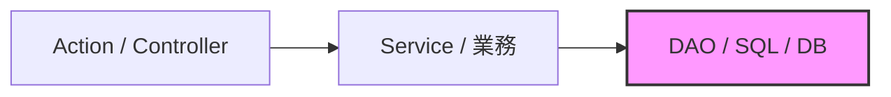

# 【勉強会資料】MVCからヘキサゴナルアーキテクチャ完全移行ガイド

## 1. なぜアーキテクチャを変更したのか？（課題と目的）

従来の「Action（Controller） → Service → DAO」によるMVC／レイヤード設計は直感的でしたが、規模の拡大に伴い以下の課題が顕在化しました。



### 従来のMVCで起きていた課題
* **データベース中心の依存関係**: ServiceがDAOのSQLやテーブル構造に引きずられ、DB都合が業務ロジックに侵入。
* **Fat Service化**: 入力検証・業務計算・DB呼出手順がServiceに集中し、クラスが肥大化。
* **テストの重さと遅さ**: 業務ルールの検証にもDB接続やWebコンテキストが必要となり、単体テストが書きにくい。
* **外部連携の変更に弱い**: メール送信や外部APIをService内で直呼び出しすると、外部障害や仕様変更に直結。

### ヘキサゴナル移行で解決されること
* **業務ルールの独立**: 純粋なビジネスロジックがDB・フレームワークから完全に分離される。
* **超高速な単体テスト**: DB接続なし・モックなしでミリ秒単位で動く軽量テストが実現する。
* **外部技術のプラグイン化**: DBや外部通信は「差し替え可能な部品（アダプター）」になる。
* **影響範囲の局所化**: 各クラスの責務が単一になり、仕様変更の影響調査が容易になる。

---

## 2. ヘキサゴナルの核: 「中心」と「ポート＆アダプター」

ヘキサゴナルアーキテクチャ（Ports and Adapters）は、「ビジネスロジックを中心に置き、外部の技術（WebやDB）をプラグイン化する」設計思想です。

```mermaid
flowchart LR
    subgraph Driving [Driving Adapter (入力側)]
        Action["Action / Web Controller"]
        Batch["Batch / CLI"]
    end

    subgraph Hexagon [アプリケーションコア（中心）]
        InPort["Inbound Port (UseCase I/F)"]
        Domain["Domain Model (業務ルール)"]
        OutPort["Outbound Port (永続化・通知 I/F)"]
        InPort --> Domain
        Domain --> OutPort
    end

    subgraph Driven [Driven Adapter (出力側)]
        DAO["DAO / JDBC Adapter"]
        Mail["Mail / API Adapter"]
    end

    Action --> InPort
    Batch --> InPort
    OutPort -. 依存性の逆転 .- DAO
    OutPort -. 依存性の逆転 .- Mail
```

### コア要素の役割
* **ドメインモデル（中心）**: 純粋なビジネスルール。DBやServletなどの外部技術・ライブラリに一切依存しない。
* **Inbound Port（入力口）**: 外部からアプリケーションを動かす窓口（例: `RegistShainUseCase`）。
* **Outbound Port（出力量）**: アプリケーションが外部に要求する能力の宣言（例: `ShainRepositoryPort`）。
* **Driving Adapter（主動部品）**: リクエストを受け取り、Inbound Portを呼ぶ（例: `ShainRegistAction`）。
* **Driven Adapter（受動部品）**: Outbound Portを具象実装し、DBや外部と通信する（例: `ShainJdbcAdapter`）。

> **💡 依存性の逆転 (DIP):**
> 依存の矢印は必ず「外側から中心」へ向かいます。ドメインはDB（DAO）を呼び出したいですが直接依存しません。「保存できる口（Outbound Port）」をコア側で宣言し、外側のDAOがそれを実装します。

---

## 3. 「MVCのこれ、ヘキサゴナルでどこ？」完全対応マップ

| 従来のMVC要素 | ヘキサゴナルでの呼び名 | 具体的な責務 | 配置パッケージ例 |
| :--- | :--- | :--- | :--- |
| **Action / Controller** | **Driving Adapter (Web)** | HTTPリクエスト取得、パラメータ検証、UseCase呼出、画面遷移 | `adapter.in.web` |
| **Service (インターフェース)** | **Inbound Port** | 外部から実行可能なユースケースの入力規約（メソッド定義） | `application.port.in` |
| **Service (実装)** | **UseCase Service** | 業務処理フローの進行役。ドメインモデルを操作してOutbound Portを呼ぶ | `application.service` |
| **DAO (インターフェース)** | **Outbound Port** | コア層が永続化や外部通知に求める能力の宣言（依存の逆転） | `application.port.out` |
| **DAO実装 / JDBC / SQL** | **Driven Adapter (DB)** | Outbound Portを実装し、SQL発行・DBトランザクションを実行 | `adapter.out.persistence` |

---

## 4. コード比較：社員登録機能（Before / After）

### 【Before】従来のMVC (Action + Service + DAO)
```java
// ServiceがDAOの具象クラスに直接依存している
public class ShainService {
    private ShainDAO shainDao = new ShainDAO(); // DBに直接依存

    public void registShain(ShainForm form) throws Exception {
        // バリデーションや業務ルールがService内に散乱
        if (form.getName() == null || form.getName().isEmpty()) {
            throw new IllegalArgumentException("名前は必須です");
        }
        ShainDTO dto = new ShainDTO(form.getName(), form.getAge());
        shainDao.insert(dto); // DB直結
    }
}
// 課題: 単体テスト時にDBが起動していないとShainServiceのテストが動かない
```

### 【After】ヘキサゴナルアーキテクチャ

#### 1. ドメイン層（純粋なJava・外部依存ゼロ）
```java
public class Shain {
    private final ShainId id;
    private final ShainName name;

    public Shain(ShainName name) {
        this.id = ShainId.generate();
        this.name = name;
    }
    public ShainName getName() { return name; }
}
```

#### 2. ポート定義（インターフェース）
```java
// Inbound Port (入力)
public interface RegistShainUseCase {
    void execute(RegistShainCommand command);
}

// Outbound Port (出力)
public interface ShainRepositoryPort {
    void save(Shain shain);
}
```

#### 3. ユースケース実装（ビジネスフロー）
```java
public class RegistShainService implements RegistShainUseCase {
    private final ShainRepositoryPort repository;

    public RegistShainService(ShainRepositoryPort repository) {
        this.repository = repository;
    }

    @Override
    public void execute(RegistShainCommand cmd) {
        Shain shain = new Shain(new ShainName(cmd.getName()));
        repository.save(shain); // SQLの存在を一切知らない
    }
}
// 利点: テスト時は repository にインメモリのダミークラスを渡すだけで1msでテスト完了
```

#### 4. アダプター層（外側の接続役）
```java
// Driving Adapter (Action)
public class ShainRegistAction implements Action {
    private final RegistShainUseCase useCase;

    public ShainRegistAction(RegistShainUseCase useCase) {
        this.useCase = useCase;
    }

    @Override
    public String execute(HttpServletRequest req, HttpServletResponse res) {
        useCase.execute(new RegistShainCommand(req.getParameter("name")));
        return "/WEB-INF/view/success.jsp";
    }
}

// Driven Adapter (DAO)
public class ShainJdbcAdapter implements ShainRepositoryPort {
    @Override
    public void save(Shain shain) {
        // ここで初めてJDBC/SQLを発行してDBに保存する
    }
}
```

---

## 5. ディレクトリ探索ガイド（修正時はどこを見る？）

* **「計算ロジックや入力値の妥当性ルールを変更したい」**
  👉 `domain/` （例: `Shain.java`, `ShainName.java`）
* **「社員登録後にメールを送る手順を追加したい」**
  👉 `application/` または `usecase/` （例: `RegistShainService.java`）
* **「JSPのパラメータ名や画面遷移先を変更したい」**
  👉 `adapter/in/web/` （例: `ShainRegistAction.java`）
* **「SQLクエリやテーブル定義を変更したい」**
  👉 `adapter/out/persistence/` （例: `ShainJdbcAdapter.java`）

---

## 6. よくある疑問と回答（FAQ）

* **Q1. クラスやインターフェースが増えて面倒ではないですか？**
  * **A.** 一見ファイル数は増えますが、1ファイルあたりの行数は激減します。修正時の影響範囲が局所化されるため、結果として変更コストとバグ調査時間が大幅に削減されます。
* **Q2. ドメインのEntityとDAOのDTOで同じようなクラスがあるのはなぜ？**
  * **A.** ドメインは「業務ルール」、DTOは「DBテーブル定義」です。目的が異なるため、分離することで「DBカラムの変更都合が業務ルールに悪影響を与える」事態を防ぎます。
* **Q3. 実装するときはどの順序で書けばいいですか？**
  * **A.** **Domain Model → Inbound Port (UseCase) → Application Service → Adapter (Web / DAO)** の順です。まず業務ロジックをテスト駆動で完成させ、最後に外側のDBや画面を接続します。
